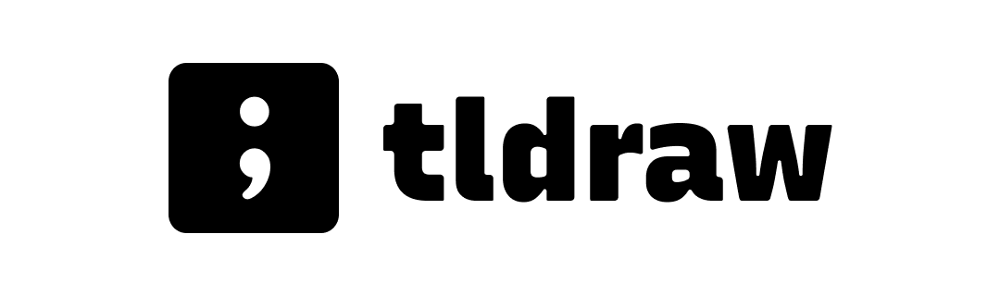

<div style="text-align: center; transform: scale(.5);">
  
</div>

# @tldraw/intersect

This package contains 2D intersection utility functions used by [tldraw](https://tldraw.com).

💕 Love this library? Consider [becoming a sponsor](https://github.com/sponsors/steveruizok?frequency=recurring&sponsor=steveruizok).

## Installation

Use your package manager of choice to install `@tldraw/vec` and its peer dependencies.

```bash
yarn add @tldraw/vec
# or
npm i @tldraw/vec
```

## Usage

This library exports a class named `Vec` that contains only static methods. You can use these methods to create 2D vectors formatted as `[x, y]`.

```tsx
import { Vec } from "@tldraw/vec"

const A = [5, 5]
const B = [10, 10]
const C = Vec.add(A, B)
```

## Community

### Support

Need help? Please [open an issue](https://github.com/tldraw/vec/issues/new) for support.

### Discussion

Want to connect with other devs? Visit the [Discord channel](https://discord.gg/s4FXZ6fppJ).

### License

This project is licensed under MIT. If you're using the library in a commercial product, please consider [becoming a sponsor](https://github.com/sponsors/steveruizok?frequency=recurring&sponsor=steveruizok).

## Author

- [@steveruizok](https://twitter.com/steveruizok)
